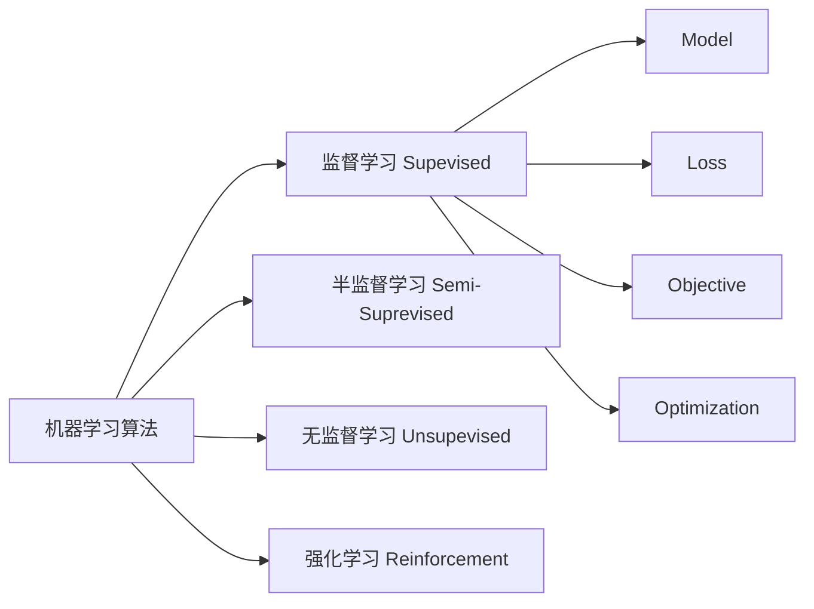

```mermaid
flowchart LR
root[机器学习算法]
A[监督学习 Supevised]
B[半监督学习 Semi-Suprevised]
C[无监督学习 Unsupevised]
D[强化学习 Reinforcement]

root --> A
root --> B
root --> C
root --> D

A --> 1[Model]
A --> 2[Loss]
A --> 3[Objective]
A --> 4[Optimization]
```

some Algorithms, 

- Decision Tree
- Linear methods
- Kernel Machines
- Neural Networks 